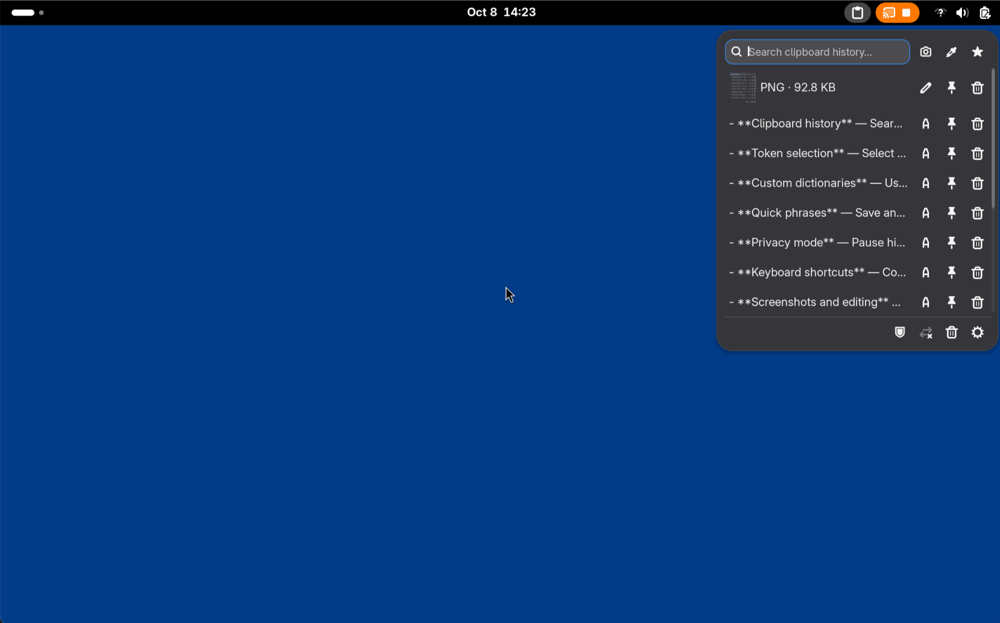
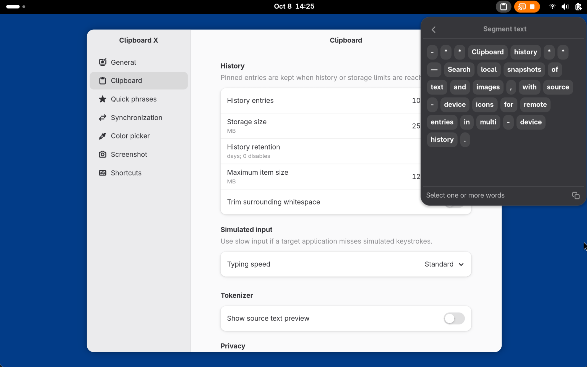
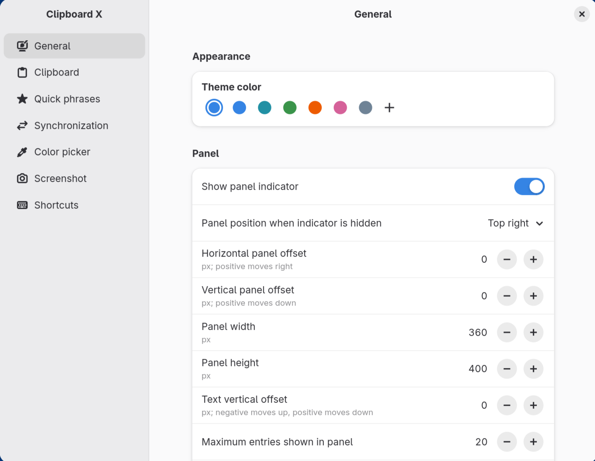

<div align="center">

# Clipboard X Gnome

**Clipboard X Gnome — 一个更顺手的 GNOME 剪切板扩展**

历史记录 · 分词选择 · 快捷语句 · 设备同步 · 截图编辑 · 快速取色

[English](README.md) · [简体中文](README.zh-CN.md)

[](https://www.gnome.org/)
[](https://gjs.guide/)
[](LICENSE.md)

</div>

Clipboard X Gnome 是一款面向 GNOME Shell 的剪切板扩展。它通过顶栏面板集中管理文本与图片历史、
分词选择和快捷语句，并提供截图、取色及调用图片编辑器的入口。需要跨设备使用时，可连接
自行配置的 `clipboard-x-server`，同步剪切板快照。

插件默认只在本机保存历史记录和快捷语句。剪切板同步需要配置服务器并主动启用；网络词库
也只会在用户添加或刷新时下载。

<details>
<summary>查看界面预览</summary>

**剪切板主面板**



**分词面板**



**设置界面**



</details>

## 功能

- **剪切板历史** — 搜索本地保存的文本和图片快照；多个设备的历史同时显示时，用设备图标区分远端条目。
- **分词选择** — 选取单个或多个词后复制、粘贴或模拟输入，同时保留链接、邮箱、数字、空白和标点。
- **自定义词库** — 使用系统 `Intl.Segmenter`，或为中文、日文组合本地与网络词库。
- **快捷语句** — 在本机保存和复用常用文本。
- **隐私模式** — 暂停记录历史；密码管理器标记的内容默认只留在内存中。
- **键盘操作** — 使用可配置快捷键打开面板，并对条目或选中的词执行操作；通过方向键导航。
- **截图编辑** — 从面板调用系统截图，使用自行配置的编辑器命令打开已复制的图片。
- **取色器** — 选取屏幕颜色，并把 HEX、RGB、HSL 或 OKLCH 颜色值复制到剪切板。
- **设备同步** — 通过自行部署的 `clipboard-x-server` 及其 Channel 手动或自动发送，并按来源设备标识远端条目。
- **按需传输** — 大量文本和图片先同步预览，需要时才获取原文；流式传输校验内容并显示精确字节进度，无需额外本地服务。
- **面板自定义** — 调整面板尺寸、显示条目数量、主题色、打开位置与焦点行为、自定义操作图标。
- **多语言界面** — 跟随系统语言，提供英文及 25 种语言的界面翻译，包括简体中文、日文、韩文、德文、法文和西班牙文。

## 安装

通过 [GNOME Shell Extensions 插件商店](https://extensions.gnome.org/) 安装：搜索 **Clipboard X Gnome**。

### 从源码安装

#### 环境要求

- GNOME Shell 50+、GJS 1.88 或更高版本；
- Meson、Ninja、GLib、GTK 4、Libadwaita、GdkPixbuf、Gettext 和 7-Zip；

构建发布包：

```sh
meson setup build -Dtarget=package
meson compile -C build
meson install -C build
```

安装生成的 `build/clipboard-x-gnome_1.0.4.zip`：

```sh
gnome-extensions install --force build/clipboard-x-gnome_1.0.4.zip
gnome-extensions enable clipboard-x-gnome@guleoo.github.io
```

如果此前安装过 `clipboard-x@guleoo.github.io`，请先禁用旧扩展再安装此版本。
新扩展使用独立设置和 `$XDG_DATA_HOME/clipboard-x-gnome` 数据目录；旧设置与数据不会
自动迁移，也不会删除。

Wayland 下的 GNOME Shell 无法完整热重载扩展代码。

首次安装或覆盖已有版本后，如果新版本没有立即生效，请注销并重新登录。

## 使用 Clipboard X Gnome

### 1. 打开并配置面板

点击顶栏图标打开 Clipboard X Gnome。全局快捷键默认留空；如果需要，请打开扩展设置，在
**快捷键 → 全局 → 打开剪切板面板**中录入。再次按下同一个面板快捷键即可关闭面板。

第一次打开面板或设置时，Clipboard X Gnome 会生成 UUID v4 `DeviceId`，作为稳定的同步身份。
用户可编辑的设备 Tag 与图标只用于友好展示，不会改变设备身份。

### 2. 复用剪切板历史

点击条目，或聚焦后按 Enter，即可复制内容。根据条目类型，每行还会提供分词或图片编辑、
固定、同步和删除操作。按 `Ctrl+F` 可以聚焦搜索框。

在**设置 → 常规 → 图标布局 → 历史**中，可隐藏或调整条目操作图标的顺序。
隐藏图标不会禁用对应的键盘快捷键。

默认的上下文快捷键如下：

| 剪切板历史中 | 操作 |
| --- | --- |
| `v` | 粘贴当前条目 |
| `p` | 固定或取消固定 |
| `Delete` | 从本机历史中删除 |
| `'` | 模拟键盘输入文本 |
| `Ctrl` + 点击 | 不复制，改为模拟输入 |

表中的键盘快捷键可以在设置中修改或禁用；`Ctrl` + 点击是固定操作。

### 3. 模拟键盘输入

目标应用无法正常粘贴时，可以尝试模拟输入：

1. 先让目标应用的文本输入框获得焦点，再打开 Clipboard X Gnome。
2. 对文本历史条目使用 `Ctrl` + 点击，或聚焦条目后按 `'`。在分词面板中，选好词后按 `'`。
3. 面板关闭后，Clipboard X Gnome 会等待触发操作的修饰键松开，再向此前聚焦的输入框逐字输入。与复制或粘贴不同，这不会替换剪切板内容。

模拟输入**不能保证与粘贴一样可靠**。GNOME Shell 无法可靠感知发送给其他 Wayland 客户端的
普通物理按键，因此字母和数字仍可能与模拟内容交错。结束前请勿操作物理键盘；中途取消时，
已输入的部分不会撤销。长文本、敏感内容或要求完全准确的内容应优先使用普通粘贴。

如果目标应用漏字，可以在**设置 → 剪切板 → 模拟输入**中选择**慢速**。这会延长按键间隔，
但不能保证所有应用都能完整接收。

> [!IMPORTANT]
> 由于 GNOME Shell 的限制，目前在模拟输入过程中，只能实现修饰键的误触检测，无法实现所有按键的误触检测。
>
> 输入过程中检测到按下 Ctrl、Alt、Shift、Super、Meta 或 Hyper 会中止模拟键盘输入，并显示 GNOME 通知。

### 4. 分词模式

点击文本条目的分词按钮。方向键用于移动焦点，点击或拖动可以连续选择词元，
`Shift` + 方向键用于键盘连选。默认按 `c` 复制、`v` 粘贴、`'` 模拟输入选择结果。

中文或日文环境可以打开**设置 → 剪切板 → 词库**，启用系统分词器、导入 UTF-8 词库，
或添加 HTTP/HTTPS 网络词库位置。词库每行写一个词，后面可以跟词频：

```text
# locale: zh
# name: 团队术语
注销密钥 90
图片编辑 80
```

插件不会捆绑第三方词库，安装、启动或打开面板时也不会静默下载词库。

### 5. 保存快捷语句

从面板打开**快捷语句**，点击 `+`，输入内容并按 Enter 确认。快捷语句仅保存在本机。
聚焦语句后，按 `v` 粘贴、`'` 模拟输入、`Delete` 删除。这些操作复用剪切板条目的快捷键配置，
添加语句的输入框仍保持正常文字编辑。

### 6. 截图、取色与图片编辑

- **截图**调用 XDG Screenshot Portal，可用的截图目标取决于本机 Portal 后端。
- **取色器**从屏幕取色，并写入配置的 HEX、RGB、HSL 或 OKLCH 表示。
  取色时可使用方向键移动采样点，每次移动一个像素。
- **图片编辑**调用**设置 → 截图 → 图片编辑**中配置的命令。

例如，填入 `gradia %i` 即可使用 Gradia。

图片编辑命令按 argv 解析，不会交给 `sh -c`。它支持 `%u` 表示图片 URI、`%f` 表示本地
路径、`%i` 表示从标准输入读取图片字节、`%%` 表示字面量百分号。例如：

```text
gradia %i
gimp %f
flatpak run be.alexandervanhee.gradia %u
```

出于安全性和可预测性考虑，不支持管道、重定向或 Shell 展开。


## 同步设备

同步功能默认关闭，可自行搭建 `clipboard-x-server` 后配置开启同步。
配置完成后，点击主面板的同步图标即可开启或关闭同步。

文本和图片的完整传输阈值同时用于发送和接收。各设备使用自己的阈值：阈值以内（含等于）
自动获取完整内容，超过阈值则仅保留预览，使用时才获取原文，即使服务器已缓存原文也是如此。
自动获取的原文若尚未存于服务器，会先请求来源设备上传。接收条目只有在所有原文格式都已
完整保存在本地后，才显示完成的勾。

连接一台设备：

1. 部署 `clipboard-x-server`，登记客户端生成的 DeviceId，为设备签发独立 API Key，并把设备加入一个 Channel。
2. 打开**设置 → 同步**。
3. 输入服务器地址和 API Key，应用设置，刷新 Channel 并选择一个活动 Channel。
4. 启动同步并测试连接。
5. 保持默认的**手动**发送模式，通过条目同步按钮发送；或明确改为**自动**发送。

**测试连接**只检查当前输入，不保存配置，也不重启同步连接；修改连接配置后，点击**应用**保存。
**应用**会立即上传当前设备名称和图标，不依赖同步是否开启；等待服务器确认并加载 Channel 后
才结束，期间按钮不可重复点击。服务器请求失败时，本地配置仍会保留，并显示失败信息。

**设置 → 同步 → 使用 sha256sum 校验文件**默认关闭。开启后使用原生流式下载和
`sha256sum`，降低大文件下载的内存峰值。开启前会检查依赖；缺失时按提示安装提供
`sha256sum` 的软件包（通常是 `coreutils`）。校验会再次读取下载的文件；依赖失效或校验失败
不会跳过完整性检查。关闭时仍使用现有 GLib 校验，无需额外命令，但大文件内存峰值可能较高。

服务器地址、API Key 和活动 Channel 保存在 `$XDG_DATA_HOME/clipboard-x-gnome/sync.json`；
各 Channel 的增量 cursor 单独保存在 `sync-state.json`。中途加入 Channel 的新设备会从
服务器保留的 Channel 变化历史开始获取元数据与预览，大体积原文仍按需加载。

待上传任务按服务器分别持久化，并绑定提交时的 Channel 和 DeviceId。上传中断或切换服务器
不会丢弃任务；重试前会检查本地条目，并请求服务器复用或确认同一发布，已经完成的内容不再
重复上传。已删除的本地条目和隐私内容不会上传。关闭同步只暂停已有任务；关闭期间复制的
条目不加入队列，重新开启后也不会自动补传。

> [!NOTE]
> 当前在扩展中删除条目，只会删除本设备的本地历史副本，不会请求从整个 Channel 删除。
> 服务端发出的删除事件则会同步到客户端。


## 数据与隐私

| 数据 | 默认位置 |
| --- | --- |
| 历史记录 | `$XDG_DATA_HOME/clipboard-x-gnome/history/<DeviceId>` |
| 快捷语句 | `$XDG_DATA_HOME/clipboard-x-gnome/quick-phrases.json` |
| 词库 | `$XDG_DATA_HOME/clipboard-x-gnome/dictionaries` |
| 同步连接信息 | `$XDG_DATA_HOME/clipboard-x-gnome/sync.json` |
| 同步 cursor | `$XDG_DATA_HOME/clipboard-x-gnome/sync-state.json` |
| 按服务器划分的待上传队列 | `$XDG_DATA_HOME/clipboard-x-gnome/sync-queues/<服务器地址哈希>.json` |

本地历史没有静态加密，也不是密码保险库。启用同步或处理敏感内容前，请阅读
[安全与隐私说明](SECURITY.zh-CN.md)。

## 开发与参与贡献

欢迎参与 Clipboard X Gnome：报告 Bug、提交聚焦的修复、改进 UI、补充协议测试、完善文档，或
提供经过认真校对的翻译，都很有价值。

1. 阅读[参与开发](CONTRIBUTING.zh-CN.md)和[中文文档索引](docs/README_CN.md)。
2. 较大的行为或协议变更应先创建 Issue，讨论并明确范围。
3. 保持改动聚焦；每次行为变更都要新增或更新测试。
4. 提交 Pull Request 前运行完整测试，并主动 Review 自己的 Diff。
5. 公开行为发生变化时，同时更新文档。

最快的交互式开发方式是：

```sh
tools/run-dev-shell.sh
```

脚本会完成构建和打包，然后在独立的 Mutter Devkit 会话中启动扩展，使用隔离的 XDG 数据
和设置，不需要注销宿主桌面。
日志沿用系统 journal，查看命令见[日志与问题排查](docs/diagnostics_CN.md)。

提交代码前运行：

```sh
meson test -C build --print-errorlogs
meson test -C build --suite stress --print-errorlogs
gnome-shell-test-tool --headless --extension build/clipboard-x-gnome_1.0.4.zip tests/ui/shell.smoke.js
gnome-shell-test-tool --headless --extension build/clipboard-x-gnome_1.0.4.zip tests/ui/preferences.smoke.js
```

项目不使用 ESLint。目录结构、本地化流程、代码约定和发布边界见
[参与开发](CONTRIBUTING.zh-CN.md)。安全问题请按照[安全说明](SECURITY.zh-CN.md)中的私密
渠道报告，不要创建公开 Issue。

## 文档

- [中文文档索引](docs/README_CN.md)
- [1.0.4 发布说明](docs/release/v1.0.4-cn.md)
- [同步协议（HTTP API v1）](https://github.com/guleoo/clipboard-x-server/blob/master/docs/zh-CN/protocol.md) — 由 Clipboard X Server 维护
- [UI 开发指南](docs/ui-architecture_CN.md)
- [同步性能与压力测试](docs/sync-performance-testing_CN.md)
- [安全与隐私](SECURITY.zh-CN.md)
- [参与开发](CONTRIBUTING.zh-CN.md)

## 许可证

Clipboard X Gnome 是以 [GNU GPL v3 或更高版本](LICENSE.md)发布的自由软件。
